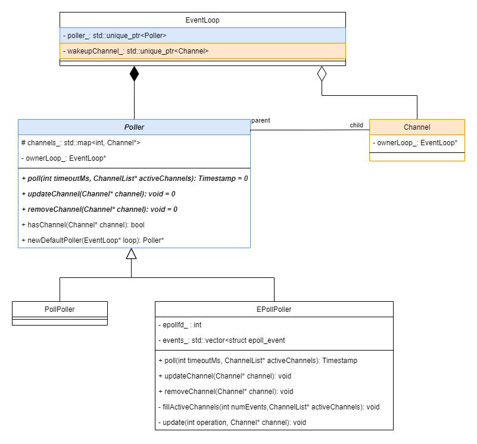
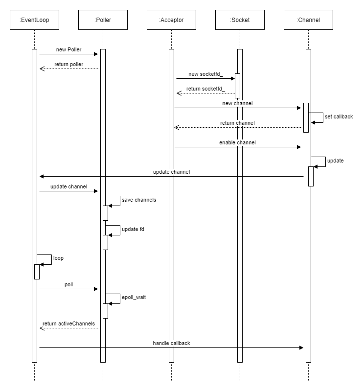

## 事件循环 EventLoop

在整个 Muduo 库中，EventLoop 承担的最重要的角色就是**事件循环**。Muduo 中强调 One loop per thread, 也就是每个 thread 拥有一个 loop，线程启动后，会在 EventLoop 的 loop 中一直循环，直到用户调用 quit 退出 loop 循环。

用户可以使用多种方式启动 EventLoop 循环:

1. 直接在主线程中启动事件循环

```cpp
int main ()
{
    EventLoop loop;
    loop.loop();
}
```

2. 用户在自己的线程内启动事件循环：

```cpp
int main ()
{
    std::thread thread = [](){
        EventLoop loop;
        loop.loop();
    };
}
```

3. 用户使用 Muduo 提供的 EventLoopThread 开启线程并启动事件循环

```cpp
EventLoopThread t;
Inspector ins(t.startLoop(), InetAddress(12345), "test");
```

在 EventLoop 的事件循环中，会调用 Poller 的 poll 接口去监听当前线程内的所有文件描述符，并执行所有文件描述符的事件回调函数。

```cpp
void EventLoop::loop()
{
    while (true)
    {
        poller_->poll();            // 监听文件描述符
        channel->handleEvent();     // 执行回调函数
    }
}
```

所以，Poller 的生命周期由 EventLoop 唯一控制，Poller 的实例是线程内全局唯一的。Poller 对象维护着 std::map<fd, Channel*> 的映射表，这个映射表中保存着本线程内所有模块需要监听的 fd 和对应的 channel。

类图关系如下：



EventLoop 类还提供了其他的功能：

* 在某个特定的时间执行回调函数 `runAt`
* 在定时时间之后执行某个回调函数 `runAfter`
* 间隔某个时间之后执行回调函数 `runEvery`

## channel

每个文件描述符 fd 对应着一个 channel，创建文件描述符 fd 之后，会使用该 fd 实例化一个 channel，并设置该 channel 的回调函数。然后将 channel 注册到 Poller 的映射表中，并将 fd 注册到 Poller 的内核监听队列中。当 Poller 监听的文件描述符事件发生之后，会由 EventLoop 调用 channel 的回调函数。

## fd 事件监听机制

实现逻辑如下：

1. 每个线程只会创建一个 EventLoop 实例，该实例会通过指针的方式传入到本线程内所有需要的模块
2. 其他模块如果需要监听某个事件，则创建自己的 fd，并创建自己的 channel 实例，然后设置该 fd 的回调函数 callback。（所以 channel 里面会有 fd 和 callback）
3. 每个模块通过传入的 EventLoop 实例的指针，将自己的 channel 和 fd 注册到(EventLoop的) poller 的映射表中，将 fd 注册到 poller 内核监听队列中
4. 如果 poller 监听的 fd 更新了状态(包括可读/可写等)，会返回给 EventLoop，由 EventLoop 执行每个 channel 的回调函数

比如 Acceptor 模块需要监听 socket 的可读事件，则整个流程如下：



## 几个问题

### 如何处理连接的建立

### 如何处理连接的断开

### 如何读消息（阻塞还是非阻塞）

### 如何处理消息的发送与重传

### 如果要主动关闭连接，如何确保对方已经完全接收到数据？如果应用层有缓冲，如何保证先发送完缓冲区的数据，再断开连接（直接调用 close(2) 恐怕是不行的）

半关闭连接：shutdown

1. 如何确保对方已经完全接收到数据？

    A 没有数据发送给 B，那么 A 关闭写端；

    B 没有数据发送给 A，那么 B 关闭写端。

2. 如果应用层有缓冲，如何保证发送完缓冲区的数据，再断开连接？

    如果发送端缓冲区还有数据，则用户调用 TcpConnection::shutdown 的时候不会立即关闭连接，只会设置标志位 state_ 为 kDisconnecting。在 TcpConnection::handleWrite 中将发送端缓冲区的数据全部发送完毕之后，会判断标志位 state_ 是否为 kDisconnecting，如果是，才会关闭连接。

### 如果主动发起连接，但是对方主动拒绝，如何定期（带 back-off）重试?

非阻塞的 connect

每次重试时间逐渐加长

代码：Connector::restart() 	Connector::retry

### 非阻塞网络中应该使用边沿触发(edge trigger)还是电平触发(level trigger)？如果是电平触发，那么什么时候关注 EPOLLOUT 事件？会不会造成 busy-loop？如果是边沿触发，如何防止漏读造成的饥饿？epoll(4)一定比poll(2)快吗？

muduo 采用的是 level trigger，所以只需要在必要的时候关注 writeable 事件，否则就会造成 busy-loop

先调用 sendInLoop 发送数据，如果无法一次性发送完，则将剩余数据写入到 outputBuffer_ 中，然后注册 EPOLLOUT 事件，等缓冲区可写的时候执行 handleWrite，数据发送完毕之后将 EPOLLOUT 事件从内核监听队列中删除，不再监听该事件。

代码：TcpConnection::sendInLoop()    TcpConnection::handleWrite()

### 非阻塞网络编程中，为什么要使用发送端缓冲区？

假设应用程序需要发送 40KB 的数据，但是操作系统的 TCP 缓冲区只有 25KB 剩余空间，那么剩下的 15KB 数据怎么办？如果等待 OS 缓冲区可用，会阻塞当前线程，因为不知道对方什么时候会收到并读取数据。因此网络库应该把这 15KB 的数据存储起来，放到这个 TCP 链接的发送缓冲区中，等待 socket 变得可写时立刻发送，这样发送操作就不会阻塞。如果应用程序又有 50KB 要发送的数据，而此时发送缓冲区中有若干尚未发送的数据，那么网络库就应该将这 50KB 数据追加到发送缓冲区的末尾，而不能立刻尝试 write()，因为这样有可能打乱数据的顺序

### 非阻塞网络编程中，为什么要使用接收端缓冲区？如何设计并使用缓冲区？

readv(2)

### 如果使用发送缓冲区，万一接收方接收缓慢，数据会不会一直堆积在发送方，造成内存暴涨？如何做应用层的流量控制？

“高水位回调”和“低水位回调”：

对应着 muduo 中的 writeCompleteCallback_ 和 highWaterMarkCallback_ 两个回调函数的处理。用户可以指定缓冲区的限值以及超过该限值之后的回调函数

### 如何设计并使用定时器？并使之于网络 IO 共用一个线程，以避免死锁

### 如何处理自连接？

在 socket fd 可写时，调用 Connector::handleWrite 回调函数，然后在该回调中判断自连接：对端 IP/Port 是否和本端 IP/Port 相同

### 为什么要使用非阻塞的 connect

非阻塞方式，为了不让客户端在 ::connect 处阻塞，用户可以设置超时时间与重试次数

### Connector::connect 中 ::connect 在什么时候会返回 EINPROGRESS(表示正在连接中)，是否已经完成了三次握手的第一次？

是的。三次握手中，如果 client 收到 server 对 SYN 的 ACK，::connect 就会返回 EINPROGRESS

三次握手：

1. client  --->    SYN      ---> server        client 发送同步报文段 SYN（也可以理解成请求连接报文段）给 server，请求建立 client 到 server 的连接；
2. server  --->    ACK&SYN  ---> client        server 发送 ACK（确认报文段）给 client，确认 client 到 server 连接的建立；
                                               同时，server 发送 SYN（请求连接报文段）给 client，请求建立 server 到 client 的连接；
3. client  --->    ACK      ---> server        client 发送 ACK（确认报文段）给 server，确认 server 到 client 连接的建立。

### 在 Connector::connecting 中注册 writeCallback 回调，什么时候会触发该回调？是否已经完成了三次握手？

当 ::connect 返回 EINPROGRESS 之后，表明该连接正在进行连接，但是还未完成连接，稍后可以使用 epoll 检测该 socket 是否可写，如果可写，则表明三次握手已经完成，连接已经建立

### 连接的关闭与退出流程，在退出流程中，各模块是如何析构的？关注正常退出与异常退出（比如 Ctrl + C 或其他信号导致的异常退出）

#### 正常退出流程

正常退出包括：

1. 应用层调用 TcpConnection::shutdown 关闭连接
2. 应用层调用 EventLoop::quit 退出事件循环

执行退出流程的过程中，会自动执行 TcpClient、TcpServer、EventLoop 等的析构函数，在各自的析构函数中会执行资源释放。主要需要释放的资源有：

1. 从 epoll 的内核监听队列中删除对应的文件监听描述符（channel::disableAll）
2. 由于每个文件描述符 fd 对应着一个 channel，该 channel 由 epoll 来管理，所以还要从 epoll 中删除每个模块的 channel（channel::remove）

EventLoop 循环结束，然后 TcpClient 或者 TcpServer 执行析构。由于 TcpConnection 是以智能指针来管理的，所以无需专门调用 TcpConnetion 的析构函数，只需要析构掉 TcpClient 或者 TcpServer，然后 TcpConnection 会自动析构。

muduo 强调用智能指针来管理对象的生命周期，从而解决析构时可能出现的资源泄漏或者其他不可预料的错误。

一个 client 对象只持有一个 TcpConnection（以 TcpConnectionPtr 的方式），而一个 server 可以同时持有多个 TcpConnection（以 std::map<string, TcpConnectionPtr> 的方式）。

TcpServer 中的监听 socket fd 在创建的时候就用 RAII 手法封装到了 acceptSocket_ 中，所以在析构函数中执行 socket fd 的关闭流程。

TcpServer 和 TcpClient 的连接 socket fd 都用来实例化 TcpConnection 对象，然后在实例化该对象的时候用 RAII 手法封装了 socket，所以当离开作用域的时候自动执行析构函数，在析构函数中执行关闭 socket 的操作。

#### 异常退出流程

>包含各种导致进程异常退出的情况，比如 `Ctrl + C` 或者其他各种异常信号

如果是 client 进程异常退出：

如果是 server 进程异常退出：

有数据写入和没有数据写入两种情况

服务端程序一般不要求安全的退出，能随时重启进程是程序设计的目标。P.354

1. 只使用操作系统能够自动回收的 IPC，不使用生命周期大于进程的 IPC，也不能使用无法重建的 IPC。也就是说，只用 TCP 作为进程通信的唯一手段，进程一退出，连接和端口自动关闭。而且无法哪一方断联，都可以重建 TCP 连接，恢复通信。
2. 不使用跨进程的 mutex 和 semaphore，也不使用共享内存。因为进程意外终止的话，无法清理资源，特别是无法解锁。
3. 不要使用父子进程共享文件描述符的方式来通信（pipe 无法重建）

#### muduo 是异常安全的吗？如果在执行析构的时候发生异常，会出现资源泄漏吗？

muduo 尝试使用智能指针来管理所有资源，所以即使发生异常，也可以在析构函数中完成资源的释放


### 遗留问题：


